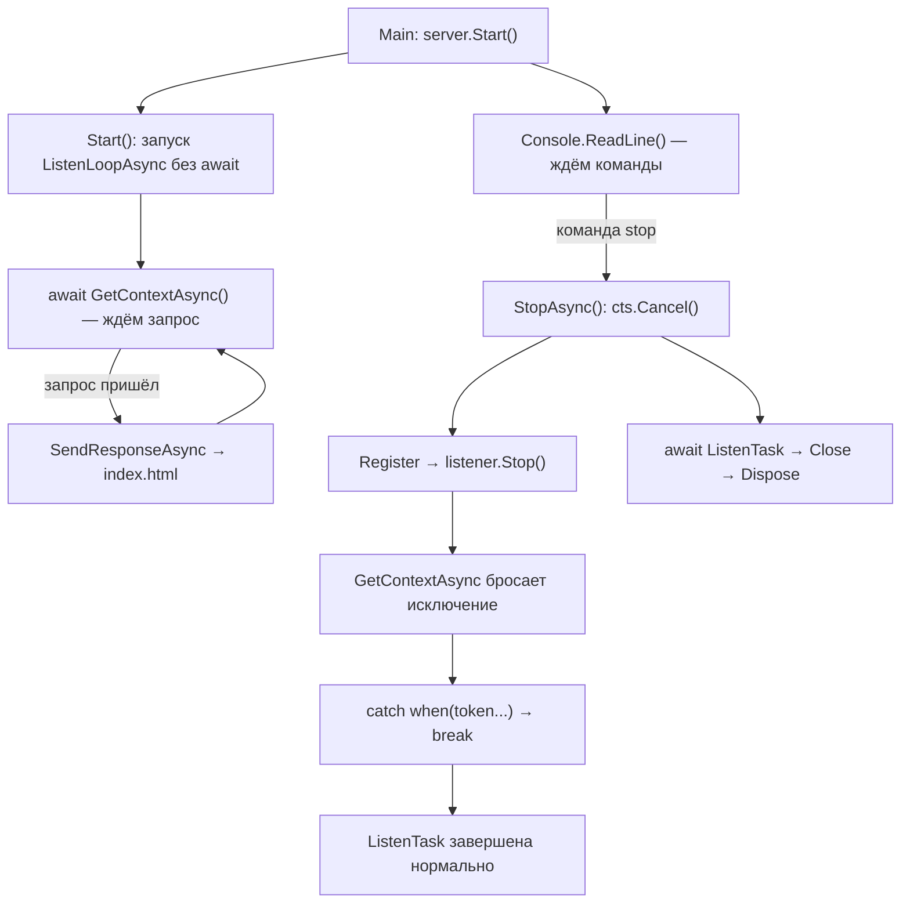

# Search_server — документация

## 1. Назначение

`Search_server` — консольное приложение на C# (.NET 10), которое запускает локальный
HTTP-сервер на базе `System.Net.HttpListener`. Сервер отдаёт одну статическую страницу
`index.html` и управляется командами, вводимыми в консоль: запуск, остановка,
перезапуск и выход.

Основной сценарий: открыть в браузере `http://127.0.0.1:8888/` и получить страницу
поиска из `index.html`.

---

## 2. Требования

- .NET SDK 10 (целевой фреймворк `net10.0`);
- Windows (используется `HttpListener` поверх HTTP.sys).

---

## 3. Сборка и запуск

Сборка:

```
dotnet build
```

Запуск:

```
dotnet run
```

Либо запуск собранного файла:

```
bin\Debug\net10.0\Search_server.exe
```

После запуска в консоли появляется строка:

```
Сервер запущен: http://127.0.0.1:8888/
```

Страница доступна в браузере по адресу `http://127.0.0.1:8888/`.

---

## 4. Консольные команды

| Команда          | Действие                                                                 |
|------------------|--------------------------------------------------------------------------|
| `start`          | Запустить сервер. Если он уже запущен — выводится сообщение и ничего не происходит. |
| `stop`           | Остановить сервер и освободить порт.                                     |
| `restart`        | Остановить сервер и сразу запустить заново.                              |
| `exit`, `quit`   | Остановить сервер и завершить работу приложения.                         |
| пустая строка    | Ничего не делает.                                                        |

Ввод нечувствителен к регистру и лишним пробелам по краям.

При завершении ввода (Ctrl+Z / EOF) или по команде `exit`/`quit` сервер сначала
останавливается, затем приложение закрывается.

---

## 5. HTTP-поведение

- Сервер принимает запросы на префиксе, переданном в конструктор (по умолчанию
  `http://127.0.0.1:8888/`).
- На любой входящий запрос отдаётся содержимое `index.html`.
- Устанавливаются заголовки: статус `200 OK`, `Content-Type: text/html; charset=utf-8`,
  точная длина содержимого.
- Поддерживается несколько одновременных запросов: обработка каждого запроса
  запускается отдельно и не блокирует цикл приёма.
- Если файл страницы прочитать не удалось, в консоль выводится сообщение об ошибке,
  а соединение корректно закрывается.

---

## 6. Структура проекта

```
Search_server/
├─ Program.cs            — весь код: класс HttpServer и точка входа Main
├─ index.html            — страница, которую отдаёт сервер
├─ Search_server.csproj  — файл проекта (index.html копируется в выходную папку)
├─ README.md             — этот файл документации
└─ bin/Debug/net10.0/    — результат сборки; сюда попадает копия index.html
```

---

## 7. Описание кода

Код состоит из класса `HttpServer` (логика сервера) и класса `Program` (точка входа).

### 7.1. Класс `HttpServer`

#### Поля и свойства

| Имя              | Тип                        | Назначение                                                        |
|------------------|----------------------------|-------------------------------------------------------------------|
| `Listener`       | `HttpListener?`            | Текущий слушатель HTTP; пустой, когда сервер остановлен.          |
| `TokenSource`    | `CancellationTokenSource?` | Источник токена отмены для цикла приёма запросов.                 |
| `ListenTask`     | `Task?`                    | Фоновая задача, в которой работает цикл приёма запросов.          |
| `Prefixes`       | `string[]`                 | Список HTTP-префиксов (адресов) для прослушивания.                |
| `ResponsePath`   | `string`                   | Путь к отдаваемому файлу (`index.html`).                          |
| `IsRunning`      | `bool` (публичное)         | `true`, если фоновая задача приёма ещё выполняется.               |

#### Конструкторы

```csharp
public HttpServer(params string[] prefixes)
```

- **Назначение:** основной конструктор.
- **Параметры:** `prefixes` — один или несколько HTTP-префиксов.
- **Поведение:** сохраняет префиксы; путь к странице вычисляет как
  `AppContext.BaseDirectory/index.html` (файл рядом с исполняемым файлом).

```csharp
public HttpServer(string responsePath, string[] prefixes)
```

- **Назначение:** конструктор с явным путём к странице.
- **Параметры:** `responsePath` — путь к файлу страницы; `prefixes` — префиксы.
- **Примечание:** параметр `prefixes` намеренно объявлен как обычный массив, а не
  `params`. Иначе вызов с одной строкой вида `new HttpServer("http://...")`
  компилятор сопоставил бы именно с этим конструктором, первый аргумент попал бы в
  `responsePath`, а список префиксов остался бы пустым, и сервер ничего не слушал бы.

#### Метод `Start()` — запуск

```csharp
public void Start()
```

- **Назначение:** запускает прослушивание и фоновый цикл приёма запросов.
- **Поведение:**
  1. если сервер уже запущен (`IsRunning`), выводит сообщение и выходит;
  2. создаёт новый `HttpListener` и добавляет в него все префиксы;
  3. вызывает `Start()` у слушателя; при ошибке (например, нет прав на префикс)
     закрывает слушатель, выводит причину и выходит;
  4. создаёт `CancellationTokenSource` и запускает `ListenLoopAsync`, сохраняя
     слушатель, источник токена и задачу в полях;
  5. выводит сообщение о запуске.
- **Особенность:** на каждый запуск создаётся новый `HttpListener`, потому что после
  `Close()` прежний объект использовать повторно нельзя. Это делает перезапуск
  безопасным.
- **Исключения:** метод не выбрасывает наружу — ошибки запуска обрабатываются внутри
  и печатаются в консоль.

#### Метод `StopAsync()` — остановка

```csharp
public async Task StopAsync()
```

- **Назначение:** корректно останавливает сервер и освобождает ресурсы.
- **Поведение:**
  1. если сервер не запущен, выводит сообщение и выходит;
  2. отменяет токен (`Cancel()`), что через регистрацию приводит к `listener.Stop()`
     и прерывает ожидание запроса;
  3. дожидается завершения фоновой задачи `ListenTask`;
  4. при необходимости останавливает и закрывает слушатель;
  5. освобождает `CancellationTokenSource` и обнуляет слушатель, токен и задачу.
- **Особенность:** перед работой значения полей копируются в локальные переменные и
  проверяются на `null`. Поэтому повторный вызов `StopAsync()` безопасен — он просто
  сообщит, что сервер не запущен.

#### Метод `ListenLoopAsync(HttpListener listener, CancellationToken token)` — цикл приёма

```csharp
private async Task ListenLoopAsync(HttpListener listener, CancellationToken token)
```

- **Назначение:** основной цикл ожидания входящих запросов.
- **Параметры:** `listener` — слушатель; `token` — токен отмены.
- **Поведение:**
  1. регистрирует действие на отмену токена: при отмене вызывается `listener.Stop()`
     (это необходимо, потому что `GetContextAsync()` не принимает `CancellationToken`);
  2. в цикле `while (!token.IsCancellationRequested)` ожидает следующий запрос;
  3. если ожидание прервано отменой — выходит из цикла штатно;
  4. при прочих ошибках приёма выводит сообщение и продолжает цикл;
  5. для каждого полученного запроса запускает `SendResponseAsync` без ожидания,
     чтобы не блокировать приём следующих запросов.

#### Метод `SendResponseAsync(HttpListenerContext context, CancellationToken token)` — ответ

```csharp
private async Task SendResponseAsync(HttpListenerContext context, CancellationToken token)
```

- **Назначение:** формирует и отправляет HTTP-ответ.
- **Параметры:** `context` — контекст принятого запроса; `token` — токен отмены.
- **Поведение:** читает файл `ResponsePath`; задаёт статус `200 OK`, тип содержимого
  `text/html; charset=utf-8` и длину; записывает данные в поток ответа.
- **Обработка ошибок:** отмена (`OperationCanceledException`) игнорируется; прочие
  ошибки печатаются.
- **Важно:** в блоке `finally` ответ всегда закрывается, иначе браузер клиента будет
  ждать бесконечно.

#### Метод `ListenConsoleLoopAsync()` — консольный интерфейс

```csharp
public async Task ListenConsoleLoopAsync()
```

- **Назначение:** читает команды из консоли и выполняет их, пока приложение работает.
- **Поведение:** печатает список команд; в цикле читает строки; передаёт каждую
  команду в `ExecuteCommandAsync`; при выходе (EOF или `exit`/`quit`) останавливает
  сервер и завершает цикл.

#### Метод `ExecuteCommandAsync(string command)` — разбор команды

```csharp
private async Task<bool> ExecuteCommandAsync(string command)
```

- **Назначение:** выполняет одну консольную команду.
- **Параметры:** `command` — команда, приведённая к нижнему регистру без лишних пробелов.
- **Возвращает:** `true` — продолжать цикл; `false` — выйти (`exit`/`quit`).
- **Команды:** `start`, `stop`, `restart`, `exit`/`quit`, пустая строка; неизвестная
  команда приводит к выводу подсказки.

### 7.2. Класс `Program`

```csharp
static async Task Main(string[] args)
```

- **Назначение:** точка входа.
- **Поведение:** создаёт `HttpServer` с префиксом `http://127.0.0.1:8888/`, запускает
  его и передаёт управление консольному циклу `ListenConsoleLoopAsync()`.

---

## 8. Как это работает (подробно)

Этот раздел объясняет внутренний механизм работы сервера: почему приём запросов и
консоль работают одновременно, зачем нужен `CancellationToken`, как программа
«просыпается» от ожидания запроса, откуда берётся исключение и как оно перехватывается.

### 8.1. Две операции, которые должны идти одновременно

Приложение выполняет две вещи:

1. ждёт HTTP-запросы — `HttpListener.GetContextAsync()`;
2. ждёт команды из консоли — `Console.ReadLine()`.

Обе операции являются **блокирующими ожиданиями**: каждая «засыпает» до наступления
события. Если выполнять их в одном потоке друг за другом, вторая никогда не начнётся,
пока не завершится первая. Поэтому их разносят по разным задачам:

- **главный поток** — консольный цикл `ListenConsoleLoopAsync` (там `Console.ReadLine`);
- **фоновая задача** `ListenTask` — цикл приёма `ListenLoopAsync`.

Ключ к одновременности — в `Start()` цикл приёма запускается **без** `await`:

```csharp
ListenTask = ListenLoopAsync(listener, cts.Token);
```

`ListenLoopAsync` — асинхронный метод. Вызов без `await` не ждёт его завершения, а лишь
запускает и сразу возвращает объект `Task`, который продолжает выполняться в фоне.
После этого `Main` идёт дальше — к `Console.ReadLine()`.

> Если написать `await ListenLoopAsync(...)` в `Start()`, программа «застрянет» на
> приёме запросов и до консоли не дойдёт.

### 8.2. Что такое `CancellationToken`

`CancellationToken` — это **флаг «пора остановиться»**. Один код поднимает флаг,
другой его проверяет. При этом флаг **никого не убивает**: задача должна сама заметить
отмену и корректно завершиться. Такой подход называется **кооперативной отменой**.

Работает это парой объектов:

| Объект                     | Роль                                                     |
|----------------------------|----------------------------------------------------------|
| `CancellationTokenSource`  | «пульт»: у него вызывают `Cancel()`                      |
| `CancellationToken`        | «табло»: его проверяют через `IsCancellationRequested`   |

В коде:

```csharp
var cts = new CancellationTokenSource();              // пульт
TokenSource = cts;
ListenTask = ListenLoopAsync(listener, cts.Token);    // отдаём «табло» в цикл
```

Токен передаётся в задачу **вручную, как параметр метода**. `Task` его не хранит и не
распространяет сама.

Почему нельзя просто «убить» задачу? Безопасного способа прервать поток извне в .NET
нет (устаревший `Thread.Abort` мог оставить объекты в несогласованном состоянии).
Поэтому отмена всегда кооперативная: код сам решает, когда проверить флаг и как
завершиться.

### 8.3. Почему одного токена недостаточно

Цикл приёма «спит» на строке:

```csharp
context = await listener.GetContextAsync();
```

Пока запросов нет, эта строка приостановила метод. Флаг отмены может стать `true`, но
**проверить его некому**: выполнение не вернулось из `await`, и до условия
`while (!token.IsCancellationRequested)` управление не дойдёт.

Хуже того, у `GetContextAsync()` **нет перегрузки, принимающей `CancellationToken`** —
флаг некуда передать. Значит одного `cts.Cancel()` мало: цикл так и останется спать,
а `StopAsync` будет вечно ждать `ListenTask`.

Нужен второй механизм — тот, что **разбудит** спящее ожидание.

### 8.4. Роль `HttpListener.Stop()`

`HttpListener.Stop()` прекращает прослушивание и **доводит висящий `GetContextAsync()`
до завершения с исключением** (`HttpListenerException` или `ObjectDisposedException`).
Именно это и «будит» цикл.

Важно: `Stop()` **не бросает исключение тому, кто его вызвал**. Он лишь помечает
ожидающую задачу как сбойную. Исключение «лежит» внутри задачи и всплывёт только в
момент `await` этой задачи — то есть на строке `await listener.GetContextAsync()` в
цикле, в другом месте программы.

```mermaid
sequenceDiagram
    participant StopAsync
    participant Cancel as cts.Cancel()
    participant Callback as Register-делегат
    participant Loop as ListenLoop (await GetContextAsync)

    StopAsync->>Cancel: Cancel()
    Cancel->>Callback: синхронно вызывает listener.Stop()
    Cancel-->>StopAsync: Cancel() завершился (сам не бросил)
    Note over Loop: ожидающая задача помечена сбойной
    Loop->>Loop: await GetContextAsync() бросает исключение
```

### 8.5. Роль `token.Register(...)` — мост между флагом и `Stop()`

Токен ничего не знает про `HttpListener`, а `HttpListener` ничего не знает про токен.
Связывает их `Register`:

```csharp
using var registration = token.Register(() =>
{
    if (listener.IsListening) listener.Stop();
});
```

`token.Register(...)` — это **подписка на событие отмены**: «когда этот токен отменят,
выполни вот этот код». По смыслу как `button.Click += ...`, только событие — «токен
отменён».

Как это работает по шагам:

1. `Register` **запоминает делегат**, но не выполняет его сразу.
2. Позже, когда кто-то вызывает `cts.Cancel()`, .NET **синхронно** вызывает этот
   делегат в том же потоке.
3. Делегат вызывает `listener.Stop()`, который будит `GetContextAsync`.

Нюансы:

- если токен **уже отменён** на момент вызова `Register`, делегат выполнится **сразу же**;
- `Register` возвращает объект-подписку; `using` отписывает делегат при выходе из
  метода, чтобы токен не держал ссылку на слушатель;
- проверка `listener.IsListening` защищает от повторного `Stop()`;
- если делегат бросит исключение, оно всплывёт наружу из `Cancel()` как
  `AggregateException`, поэтому делегат должен быть быстрым и безопасным.

### 8.6. Полная последовательность остановки

Команда `stop` вызывает `StopAsync()`:

```csharp
cts.Cancel();
try { await task; } catch (Exception ex) { ... }
if (listener.IsListening) listener.Stop();
listener.Close();
```

Что происходит по шагам:

1. **`cts.Cancel()`** — флаг отмены поднят. Внутри этого же вызова синхронно срабатывает
   `Register`-делегат и вызывает `listener.Stop()`. Сам `Cancel()` исключения не бросает
   (при условии, что делегат его не бросил).
2. **`listener.Stop()`** будит спящий `GetContextAsync()` — его задача становится сбойной.
3. В цикле управление возвращается на строку `await listener.GetContextAsync()`, и
   **здесь** выбрасывается исключение. Оно перехватывается первым `catch`:

   ```csharp
   catch (Exception) when (token.IsCancellationRequested)
   {
       break;
   }
   ```

   Фильтр `when (token.IsCancellationRequested)` означает: «проглотить исключение только
   если мы сами просили остановку».
4. `break` выходит из `while`, метод `ListenLoopAsync` завершается. Задача завершается
   **нормально**, а не как сбойная, потому что исключение было обработано.
5. **`await task`** в `StopAsync` дожидается этого завершения и возвращается без
   исключения. Дополнительный `try/catch` вокруг него — страховка.
6. Слушатель останавливается и закрывается, `CancellationTokenSource` освобождается,
   поля обнуляются.

Если бы исключение из `GetContextAsync` **не** ловить, задача стала бы сбойной, и
`await task` в `StopAsync` перебросило бы исключение в вызывающий код. Смысл `catch` с
`break` — превратить «страшное» исключение отмены в спокойное завершение.

### 8.7. Почему проверка в `while` и в `catch` — не дублирование

```csharp
while (!token.IsCancellationRequested)                                 // проверка ДО сна
{
    try { context = await listener.GetContextAsync(); }
    catch (Exception) when (token.IsCancellationRequested) { break; }  // реакция ПОСЛЕ пробуждения
}
```

Это два разных момента времени:

- условие `while` — «**не засыпай**, если уже пора уходить» (отмена пришла между итерациями);
- `catch ... when` — «**проснулся от будильника** — встань и уйди» (отмена пришла во время
  ожидания).

Условие защищает от случая, когда токен отменён, но разбудить ожидание по какой-то
причине не удалось: тогда цикл не войдёт в новую итерацию и всё равно завершится.

### 8.8. Что происходит с активными запросами

Токен передаётся и в обработку запроса:

```csharp
byte[] buffer = await File.ReadAllBytesAsync(ResponsePath, token);
await output.WriteAsync(buffer, token);
```

Методы, принимающие `CancellationToken`, при отмене прерываются и бросают
`OperationCanceledException`. В `SendResponseAsync` он ловится отдельно и не считается
ошибкой:

```csharp
catch (OperationCanceledException) { }
catch (Exception ex) { Console.WriteLine($"Ошибка обработки запроса: {ex.Message}"); }
finally { response.Close(); }
```

Блок `finally` гарантирует, что ответ всегда закрывается, и клиент не «зависнет» в
ожидании.

### 8.9. Два разных исключения

Часто путают два исключения — они возникают в разных местах:

| Где возникает | От чего | Кто его видит |
|---|---|---|
| Внутри `Cancel()` | только если **наш делегат** бросил исключение | тот, кто вызвал `Cancel()` (то есть `StopAsync`) |
| В `await GetContextAsync()` | `listener.Stop()` «уронил» ожидание | код цикла `ListenLoopAsync` |

То есть `cts.Cancel()` сам по себе не бросает исключение, и исключение отмены прилетает
не в `StopAsync`, а в цикл приёма — ровно туда, где стоит `try/catch`.

### 8.10. Общая картина



---

## 9. Настройка

- **Адрес и порт.** Задаются в `Program.Main` через префикс:
  ```csharp
  var server = new HttpServer("http://127.0.0.1:8888/");
  ```
  Например, `http://127.0.0.1:9000/` изменит порт на 9000.
- **Отдаваемый файл.** По умолчанию берётся `index.html` рядом с исполняемым файлом.
  Другой файл можно задать вторым конструктором:
  ```csharp
  var server = new HttpServer("page.html", new[] { "http://127.0.0.1:8888/" });
  ```

---

## 10. Возможные проблемы и решения

| Симптом | Причина | Решение |
|---|---|---|
| Браузер: «отказано в подключении» | Сервер не запущен, слушает другой адрес, или список префиксов пуст | Убедиться, что выведено «Сервер запущен», и открывать именно `http://127.0.0.1:8888/` |
| Браузер не открывает `http://localhost:8888/`, а `127.0.0.1` работает | `localhost` может разрешаться в IPv6 `::1`, а сервер слушает IPv4 | Использовать `http://127.0.0.1:8888/` |
| «Не удалось запустить сервер: Access is denied» | Нет прав на регистрацию префикса | Запуск от администратора или<br>`netsh http add urlacl url=http://127.0.0.1:8888/ user=Everyone` |
| «Не удалось запустить сервер: ... conflicted ...» | Порт занят другим процессом | Освободить порт или выбрать другой |
| Страница не отдаётся, в консоли ошибка чтения файла | `index.html` отсутствует рядом с `.exe` | Убедиться, что проект скопировал `index.html` в выходную папку |
| Вкладка «висит» | Ответ не закрывается или файл читается слишком долго | Это исправлено: ответ всегда закрывается в `finally` |

---

## 11. Замечания по разработке

- Повторный запуск (`start`, когда сервер уже работает) безопасен: выводится сообщение
  и ничего не происходит.
- Повторная остановка (`stop`, когда сервер уже остановлен) безопасна: выводится
  сообщение «Сервер не запущен».
- `restart` реализован как последовательность `StopAsync()` и `Start()`, поэтому
  корректно освобождает порт перед новым запуском.
- Все сообщения о состоянии выводятся в консоль, что упрощает диагностику.
